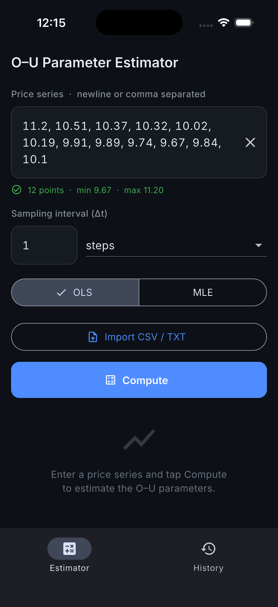
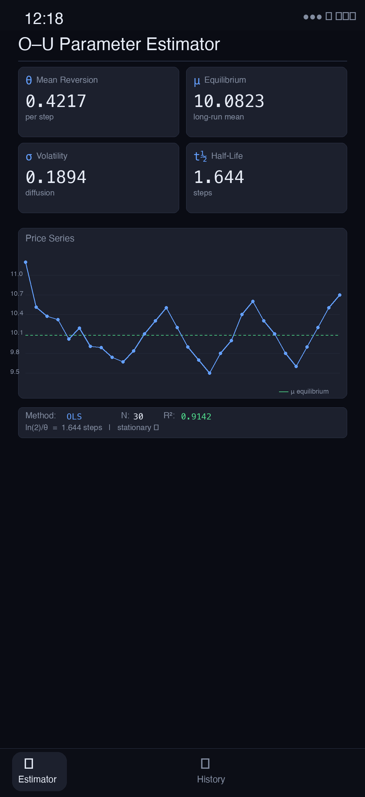

<p align="center">
  
</p>

# ou_estimator - Mean Reversion Parameter Estimator for Flutter

[](https://github.com/rakibulmehedi/ou_estimator/actions/workflows/ci.yml)
[](https://github.com/rakibulmehedi/ou_estimator/releases)
[](LICENSE)
[](https://flutter.dev)

Mean reversion timing is everything in pairs trading. ou_estimator fits Ornstein-Uhlenbeck parameters (theta, mu, sigma, and half-life) from any uniformly-sampled price series on your phone, using OLS regression for instant results or exact MLE for maximum accuracy.

## Table of Contents

- [Ornstein-Uhlenbeck Parameter Estimation](#ornstein-uhlenbeck-parameter-estimation)
- [Screenshots](#screenshots)
- [Features](#features)
- [Getting Started](#getting-started)
- [Usage](#usage)
- [Architecture](#architecture)
- [Testing](#testing)
- [Export Format](#export-format)
- [Commands](#commands)
- [Contributing](#contributing)
- [License](#license)

## Ornstein-Uhlenbeck Parameter Estimation

The Ornstein-Uhlenbeck (OU) process is the standard stochastic model for mean-reverting time series in quantitative finance. Given a spread or price series, estimating OU parameters answers the key questions for pairs trading:

| Parameter | Symbol | Meaning |
|-----------|--------|---------|
| Mean reversion speed | θ (theta) | How quickly the series pulls back to equilibrium |
| Long-run equilibrium | μ (mu) | The value the series reverts toward |
| Volatility | σ (sigma) | Noise amplitude around the mean-reverting path |
| **Half-life** | — | Time to revert 50% toward μ — the core entry/exit sizing input |

**Two estimation methods, one app:**

- **OLS (Ordinary Least Squares):** AR(1) regression via discrete approximation — instant results, suitable for quick spread analysis
- **MLE (Maximum Likelihood Estimation):** uses the exact OU transition density, optimized via Nelder-Mead — higher accuracy for short series or high-frequency data

ou_estimator is the only mobile tool for OU parameter estimation, running entirely on-device with no data leaving your phone.

## Screenshots

<p align="center">
  
  &nbsp;&nbsp;
  
</p>

## Features

- **OLS estimator:** discrete AR(1) regression, instant results
- **MLE estimator:** exact Ornstein-Uhlenbeck transition density via pure-Dart Nelder-Mead simplex
- **Fit diagnostics:** R², residual std, log-likelihood, observation count
- **Mean reversion chart:** price series overlaid with equilibrium line
- **History:** saves every run to Isar; reload, rename, or delete from the History tab
- **Export / Share:** JSON export via native OS share sheet
- **File import:** CSV or plain-text series via file picker
- **Glass-morphic dark theme:** Inter + JetBrains Mono with animated entrances
- **Adaptive layout:** NavigationBar on compact screens, NavigationRail on wide

## Getting Started

### Prerequisites

| Tool | Version |
|------|---------|
| Flutter (via fvm) | `>=3.22` |
| Dart SDK | `>=3.4.0 <4.0.0` |
| fvm | any recent |

Install fvm:

```bash
dart pub global activate fvm
```

### Setup

```bash
fvm flutter pub get
make codegen   # generates Isar schema (ou_metrics.g.dart, time_series_data.g.dart)
make run
```

## Usage

1. Paste a price series (comma or newline separated) or import a CSV/TXT file
2. Set the sampling interval (seconds, minutes, hours, or days)
3. Choose **OLS** (fast) or **MLE** (accurate) and tap **Estimate**
4. Read theta (speed), mu (equilibrium), sigma (volatility), and half-life from the results
5. Export as JSON or save to history for later comparison

A half-life of 5 days means the spread reverts halfway to equilibrium in 5 days, useful for sizing entries in a pairs trade.

## Architecture

```
lib/
├── domain/
│   ├── value/
│   │   ├── estimation_method.dart   EstimationMethod enum (ols | mle)
│   │   └── dt_unit.dart             Sampling interval units
│   └── use_cases/
│       ├── ou_estimator.dart        OLS estimator → OUResult
│       ├── mle_estimator.dart       MLE estimator (exact transition density)
│       └── nelder_mead.dart         Pure-Dart Nelder-Mead simplex optimizer
├── data/
│   ├── models/
│   │   ├── ou_metrics.dart          Isar @collection — stored estimation result
│   │   └── time_series_data.dart    Isar @collection — stored dataset
│   ├── repositories/
│   │   └── estimation_repository.dart  save / loadAll / rename / delete
│   └── services/
│       ├── export_service.dart      JSON serialization + share_plus
│       ├── file_import_service.dart CSV/TXT file picker
│       └── text_input_parser.dart   Inline series parser
├── providers/
│   └── providers.dart               All Riverpod providers
└── ui/
    ├── shell/                        AppShell — adaptive nav
    ├── estimation/                   Estimation screen + widgets
    ├── history/                      History screen + HistoryRunCard
    └── core/                         Theme, tokens, shared widgets
```

State management: Riverpod 2 throughout. `NotifierProvider` for the estimation controller, `FutureProvider.autoDispose` for history, `StateProvider` for tab index and series-text sync.

## Testing

```bash
make test
```

84 tests, 0 failures.

| Test file | Coverage |
|-----------|---------|
| `ou_estimator_test.dart` | OLS math, edge cases, diagnostics (R², s, logL, N) |
| `mle_estimator_test.dart` | MLE recovery, bounds, exceptions |
| `nelder_mead_test.dart` | 2D/3D quadratic minimization |
| `export_service_test.dart` | JSON shape validation |
| `estimation_controller_test.dart` | State transitions, error paths |
| `estimation_state_test.dart` | copyWith completeness |
| `text_input_parser_test.dart` | Comma/newline/mixed parsing |
| `dt_unit_test.dart` | Unit labels and secondsPerUnit |
| `ui/` (9 files) | Widget smoke tests, layout, glass cards |

## Export Format

```json
{
  "version": 1,
  "name": "AAPL_daily",
  "method": "ols",
  "estimatedAt": "2026-06-30T00:00:00.000Z",
  "samplingIntervalSeconds": 86400.0,
  "parameters": { "theta": 0.338, "mu": 150.2, "sigma": 0.58, "halfLife": 2.05 },
  "diagnostics": { "rSquared": 0.97, "residualStd": 0.12, "logLikelihood": -45.2, "n": 251 }
}
```

## Commands

<!-- AUTO-GENERATED from Makefile -->
| Command | Description |
|---------|-------------|
| `make get` | `fvm flutter pub get` |
| `make analyze` | `fvm flutter analyze` |
| `make test` | `fvm flutter test` |
| `make coverage` | Run tests with coverage and open HTML report |
| `make build-debug` | Debug APK |
| `make build-aab` | Release Android App Bundle |
| `make build-release` | Release APKs split per ABI |
| `make clean` | `fvm flutter clean` |
| `make run` | `fvm flutter run` |
| `make codegen` | Regenerate Isar schema via build_runner |
<!-- END AUTO-GENERATED -->

## Contributing

Contributions welcome. Read [CONTRIBUTING.md](CONTRIBUTING.md) for setup instructions, commit conventions, and the PR process.

## License

MIT. See [LICENSE](LICENSE).
